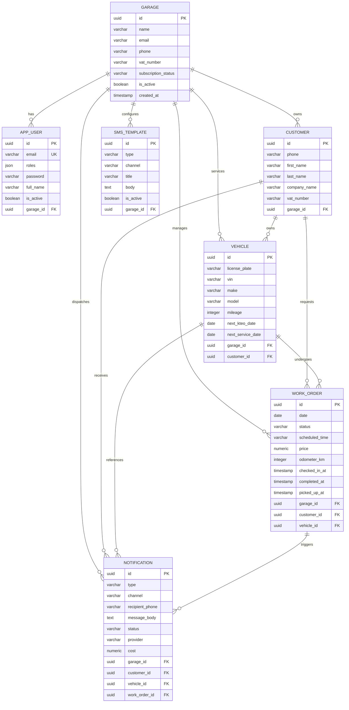

# Database Tables Schema

Comprehensive reference documentation for PostgreSQL tables in the **Garage Management System Backend**.

---

## 1. Architectural Principles

- **Primary Keys:** Native **UUIDv7** for all entities (`Symfony\Component\Uid\Uuid` / Doctrine `UuidType`). Provides time-ordered sorting and high concurrency without ID collisions.
- **Multi-Tenancy (Tenant Isolation):** Every operational table (`app_user`, `customer`, `vehicle`, `work_order`, `sms_template`, `notification`) is partitioned by `garage_id`. Queries and operations must strictly scope down to the authenticated user's tenant (`garage`).
- **Cascade Deletions:** Deleting a `garage` cascades down to all associated users, customers, vehicles, work orders, templates, and notifications.
- **Audit & Reminders:** Reminders and audit logs retain referential integrity with `SET NULL` for vehicle/work order deletions where applicable, ensuring financial and communication history remains intact.

---

## 2. Entity Relationship Diagram (ERD)

---

## 3. Detailed Tables Specification

### 3.1 `garage` (Tenants)
Represents a physical garage / workshop entity in the multi-tenant system.

| Column | Type | Nullable | Description |
| :--- | :--- | :---: | :--- |
| `id` | `UUID` | **NO** | Primary Key (UUIDv7). |
| `name` | `VARCHAR(255)` | **NO** | Workshop business name (e.g., `"Auto Fix Central"`). |
| `email` | `VARCHAR(255)` | **NO** | Primary contact and administrative email. |
| `phone` | `VARCHAR(50)` | YES | Workshop landline or primary telephone. |
| `vat_number` | `VARCHAR(50)` | YES | ΑΦΜ (Tax identification number). |
| `tax_office` | `VARCHAR(100)` | YES | ΔΟΥ (Competent tax authority). |
| `address` | `VARCHAR(255)` | YES | Physical street address. |
| `city` | `VARCHAR(100)` | YES | City (e.g., `"Athens"`). |
| `postal_code` | `VARCHAR(20)` | YES | Postal / ZIP code (e.g., `"11527"`). |
| `subscription_status` | `VARCHAR(30)` | **NO** | Subscription tier: `'trial'`, `'active'`, `'past_due'`, `'cancelled'`. |
| `is_active` | `BOOLEAN` | **NO** | Operational status flag (default: `true`). |
| `created_at` | `TIMESTAMP` | **NO** | Workshop registration timestamp. |
| `updated_at` | `TIMESTAMP` | YES | Last profile modification timestamp. |

#### Indexes & Constraints
- **Primary Key:** `garage_pkey` on `(id)`.

---

### 3.2 `app_user` (Users & Authentication)
Staff members and administrators authenticating via JWT.

| Column | Type | Nullable | Description |
| :--- | :--- | :---: | :--- |
| `id` | `UUID` | **NO** | Primary Key (UUIDv7). |
| `garage_id` | `UUID` | **NO** | Foreign Key -> `garage.id` (`ON DELETE CASCADE`). |
| `email` | `VARCHAR(180)` | **NO** | Unique login email identifier. |
| `roles` | `JSON` | **NO** | Granted role array: `['ROLE_GARAGE_ADMIN']`, `['ROLE_MECHANIC']`. |
| `password` | `VARCHAR(255)` | **NO** | Hashed password (Bcrypt / Argon2id). |
| `full_name` | `VARCHAR(150)` | **NO** | User display name (e.g., `"Γιώργος Παπαδόπουλος"`). |
| `phone` | `VARCHAR(50)` | YES | Mobile phone of the employee. |
| `is_active` | `BOOLEAN` | **NO** | Account state flag (default: `true`). |
| `created_at` | `TIMESTAMP` | **NO** | Account creation timestamp. |
| `updated_at` | `TIMESTAMP` | YES | Last profile update timestamp. |

#### Indexes & Constraints
- **Primary Key:** `app_user_pkey` on `(id)`.
- **Unique Constraint:** `uniq_user_email` on `(email)`.
- **Foreign Key:** `garage_id` -> `garage(id)` ON DELETE CASCADE.
- **Composite Indexes:**
  - `idx_user_garage_id` on `(garage_id)`
  - `idx_user_garage_is_active` on `(garage_id, is_active)`

---

### 3.3 `customer` (Clients / Vehicle Owners)
B2C retail drivers or B2B commercial fleet accounts.

| Column | Type | Nullable | Description |
| :--- | :--- | :---: | :--- |
| `id` | `UUID` | **NO** | Primary Key (UUIDv7). |
| `garage_id` | `UUID` | **NO** | Foreign Key -> `garage.id` (`ON DELETE CASCADE`). |
| `phone` | `VARCHAR(50)` | **NO** | Primary mobile phone used for SMS/Viber dispatch and lookup. |
| `secondary_phone` | `VARCHAR(50)` | YES | Alternative contact number (landline, work). |
| `first_name` | `VARCHAR(100)` | YES | Client first name (e.g., `"Νίκος"`). |
| `last_name` | `VARCHAR(100)` | YES | Client last name (e.g., `"Παπαδόπουλος"`). |
| `email` | `VARCHAR(180)` | YES | Contact email address. |
| `company_name` | `VARCHAR(150)` | YES | B2B business or fleet name (e.g., `"Fast Courier Express"`). |
| `vat_number` | `VARCHAR(50)` | YES | Company ΑΦΜ for invoicing. |
| `tax_office` | `VARCHAR(100)` | YES | Company ΔΟΥ. |
| `address` | `VARCHAR(255)` | YES | Billing / physical address. |
| `city` | `VARCHAR(100)` | YES | City. |
| `postal_code` | `VARCHAR(20)` | YES | Postal code. |
| `notes` | `TEXT` | YES | Internal notes regarding preferences or customer history. |
| `created_at` | `TIMESTAMP` | **NO** | Record creation timestamp. |
| `updated_at` | `TIMESTAMP` | YES | Last update timestamp. |

#### Indexes & Constraints
- **Primary Key:** `customer_pkey` on `(id)`.
- **Foreign Key:** `garage_id` -> `garage(id)`.
- **Composite Indexes:**
  - `idx_customer_garage_phone` on `(garage_id, phone)` (fast lookup during intake)
  - `idx_customer_garage_last_name` on `(garage_id, last_name)`
  - `idx_customer_garage_created_at` on `(garage_id, created_at)`

---

### 3.4 `vehicle` (Vehicles & Motorcycles)
Client vehicles undergoing service, repairs, and reminder tracking.

| Column | Type | Nullable | Description |
| :--- | :--- | :---: | :--- |
| `id` | `UUID` | **NO** | Primary Key (UUIDv7). |
| `garage_id` | `UUID` | **NO** | Foreign Key -> `garage.id` (`ON DELETE CASCADE`). |
| `customer_id` | `UUID` | **NO** | Foreign Key -> `customer.id` (`ON DELETE CASCADE`). |
| `license_plate` | `VARCHAR(20)` | **NO** | License plate (e.g., `"IKA 4821"`), normalized uppercase. |
| `vin` | `VARCHAR(50)` | YES | Vehicle Identification Number (Chassis). |
| `make` | `VARCHAR(100)` | **NO** | Manufacturer (e.g., `"Yamaha"`, `"Toyota"`). |
| `model` | `VARCHAR(100)` | **NO** | Model (e.g., `"TMAX 560"`, `"Yaris"`). |
| `year` | `INTEGER` | YES | Manufacturing year (e.g., `2022`). |
| `engine_code` | `VARCHAR(50)` | YES | Engine model / serial code. |
| `engine_displacement`| `INTEGER` | YES | Engine capacity in cc (e.g., `560`). |
| `engine_power_hp` | `INTEGER` | YES | Horsepower (hp). |
| `fuel_type` | `VARCHAR(30)` | YES | Fuel type: `'gasoline'`, `'diesel'`, `'electric'`, `'hybrid'`. |
| `transmission` | `VARCHAR(30)` | YES | Transmission: `'manual'`, `'automatic'`, `'cvt'`. |
| `color` | `VARCHAR(50)` | YES | Exterior color. |
| `first_registration_date` | `DATE` | YES | Date of first road registration. |
| `mileage` | `INTEGER` | YES | Current odometer reading in km. |
| `last_service_date`| `DATE` | YES | Date of last completed maintenance service. |
| `last_service_mileage` | `INTEGER` | YES | Odometer reading at last service. |
| `next_kteo_date` | `DATE` | YES | Expiration date of technical inspection (ΚΤΕΟ). |
| `next_service_date`| `DATE` | YES | Expected date for upcoming maintenance. |
| `next_service_mileage` | `INTEGER` | YES | Expected km threshold for upcoming maintenance. |
| `last_kteo_reminder_sent_at` | `TIMESTAMP` | YES | Timestamp of last dispatched KTEO notification. |
| `last_service_reminder_sent_at` | `TIMESTAMP` | YES | Timestamp of last dispatched service notification. |
| `allow_reminders` | `BOOLEAN` | **NO** | Opt-in flag for SMS/Viber marketing & reminders (default: `true`). |
| `notes` | `TEXT` | YES | Mechanical notes, aftermarket modifications, special oils. |
| `created_at` | `TIMESTAMP` | **NO** | Vehicle registration timestamp. |
| `updated_at` | `TIMESTAMP` | YES | Last vehicle details modification. |

#### Indexes & Constraints
- **Primary Key:** `vehicle_pkey` on `(id)`.
- **Foreign Keys:**
  - `garage_id` -> `garage(id)` ON DELETE CASCADE
  - `customer_id` -> `customer(id)` ON DELETE CASCADE
- **Composite Indexes:**
  - `idx_vehicle_garage_license_plate` on `(garage_id, license_plate)`
  - `idx_vehicle_garage_vin` on `(garage_id, vin)`
  - `idx_vehicle_garage_next_kteo_date` on `(garage_id, next_kteo_date)`
  - `idx_vehicle_garage_next_service_date` on `(garage_id, next_service_date)`
  - `idx_vehicle_customer_id` on `(customer_id)`
  - `idx_vehicle_garage_created_at` on `(garage_id, created_at)`

---

### 3.5 `work_order` (Repairs & Workflow Jobs)
Represents a job card on the workshop floor, tracking status, labor, parts, and timestamps.

| Column | Type | Nullable | Description |
| :--- | :--- | :---: | :--- |
| `id` | `UUID` | **NO** | Primary Key (UUIDv7). |
| `garage_id` | `UUID` | **NO** | Foreign Key -> `garage.id` (`ON DELETE CASCADE`). |
| `customer_id` | `UUID` | **NO** | Foreign Key -> `customer.id` (`ON DELETE CASCADE`). |
| `vehicle_id` | `UUID` | **NO** | Foreign Key -> `vehicle.id` (`ON DELETE CASCADE`). |
| `date` | `DATE` | **NO** | Scheduled or intake date. |
| `status` | `VARCHAR(30)` | **NO** | Workflow status: `'scheduled'`, `'checked_in'`, `'active'`, `'waiting_parts'`, `'waiting_customer'`, `'completed'`. |
| `scheduled_time` | `VARCHAR(20)` | YES | Appointment time slot (e.g., `"10:30"`). |
| `description` | `TEXT` | **NO** | Diagnosis or requested tasks. |
| `price` | `NUMERIC(10,2)`| **NO** | Total job price in EUR (default: `0.00`). |
| `odometer_km` | `INTEGER` | YES | Recorded odometer reading at entrance. |
| `notes` | `TEXT` | YES | Internal mechanics / workshop diagnostic notes. |
| `parts_notes` | `TEXT` | YES | Tracking notes for supplier parts orders. |
| `checked_in_at` | `TIMESTAMP` | YES | Server-generated timestamp when vehicle entered the bay. |
| `completed_at` | `TIMESTAMP` | YES | Server-generated timestamp when work was completed. |
| `picked_up_at` | `TIMESTAMP` | YES | Server-generated timestamp when vehicle was delivered to owner. |
| `created_at` | `TIMESTAMP` | **NO** | Work order creation timestamp. |
| `updated_at` | `TIMESTAMP` | YES | Last update timestamp. |

#### Indexes & Constraints
- **Primary Key:** `work_order_pkey` on `(id)`.
- **Foreign Keys:**
  - `garage_id` -> `garage(id)` ON DELETE CASCADE
  - `customer_id` -> `customer(id)` ON DELETE CASCADE
  - `vehicle_id` -> `vehicle(id)` ON DELETE CASCADE
- **Composite Indexes:**
  - `idx_work_order_garage_status` on `(garage_id, status)` (Kanban board filter)
  - `idx_work_order_garage_date` on `(garage_id, date)`
  - `idx_work_order_customer_date` on `(customer_id, date)`
  - `idx_work_order_vehicle_date` on `(vehicle_id, date)`

---

### 3.6 `sms_template` (Message Templates)
Preconfigured message templates with variable tokens (`{owner}`, `{plate}`, `{price}`, `{model}`) for automated dispatch.

| Column | Type | Nullable | Description |
| :--- | :--- | :---: | :--- |
| `id` | `UUID` | **NO** | Primary Key (UUIDv7). |
| `garage_id` | `UUID` | **NO** | Foreign Key -> `garage.id` (`ON DELETE CASCADE`). |
| `type` | `VARCHAR(50)` | **NO** | Template trigger type: `'ready_for_pickup'`, `'service_reminder'`, `'kteo_reminder'`, `'custom'`. |
| `channel` | `VARCHAR(20)` | **NO** | Delivery channel: `'sms'`, `'viber'`, `'all'`. |
| `title` | `VARCHAR(100)`| **NO** | Template administrative label. |
| `body` | `TEXT` | **NO** | Template message body containing tokens. |
| `is_active` | `BOOLEAN` | **NO** | Active state toggle (default: `true`). |
| `created_at` | `TIMESTAMP` | **NO** | Template creation timestamp. |
| `updated_at` | `TIMESTAMP` | YES | Last update timestamp. |

#### Indexes & Constraints
- **Primary Key:** `sms_template_pkey` on `(id)`.
- **Foreign Key:** `garage_id` -> `garage(id)` ON DELETE CASCADE.
- **Composite Indexes:**
  - `idx_sms_template_garage_type` on `(garage_id, type)`
  - `idx_sms_template_garage_is_active` on `(garage_id, is_active)`

---

### 3.7 `notification` (Notification Audit Log)
Complete record of communication history, deep link clicks, and carrier dispatch statuses.

| Column | Type | Nullable | Description |
| :--- | :--- | :---: | :--- |
| `id` | `UUID` | **NO** | Primary Key (UUIDv7). |
| `garage_id` | `UUID` | **NO** | Foreign Key -> `garage.id` (`ON DELETE CASCADE`). |
| `customer_id` | `UUID` | **NO** | Foreign Key -> `customer.id` (`ON DELETE CASCADE`). |
| `vehicle_id` | `UUID` | YES | Foreign Key -> `vehicle.id` (`ON DELETE SET NULL`). |
| `work_order_id`| `UUID` | YES | Foreign Key -> `work_order.id` (`ON DELETE SET NULL`). |
| `type` | `VARCHAR(50)` | **NO** | Communication category: `'ready_for_pickup'`, `'service_reminder'`, `'kteo_reminder'`, `'custom'`. |
| `channel` | `VARCHAR(20)` | **NO** | Channel used: `'sms'`, `'viber'`. |
| `recipient_phone` | `VARCHAR(50)` | **NO** | Dispatched destination phone number. |
| `message_body` | `TEXT` | **NO** | Actual compiled text message dispatched. |
| `status` | `VARCHAR(30)` | **NO** | Delivery status: `'pending'`, `'sent'`, `'delivered'`, `'failed'`. |
| `provider` | `VARCHAR(50)` | **NO** | Gateway / protocol: `'native_deeplink'`, `'easysms'`. |
| `provider_message_id` | `VARCHAR(100)` | YES | External message ID from SMS gateway. |
| `cost` | `NUMERIC(6,4)` | YES | Cost in EUR (e.g., `0.0350`). |
| `sent_at` | `TIMESTAMP` | YES | Dispatch timestamp. |
| `delivered_at` | `TIMESTAMP` | YES | Carrier delivery report timestamp. |
| `error_message`| `TEXT` | YES | Gateway error description if dispatch failed. |
| `created_at` | `TIMESTAMP` | **NO** | Audit record timestamp. |

#### Indexes & Constraints
- **Primary Key:** `notification_pkey` on `(id)`.
- **Foreign Keys:**
  - `garage_id` -> `garage(id)` ON DELETE CASCADE
  - `customer_id` -> `customer(id)` ON DELETE CASCADE
  - `vehicle_id` -> `vehicle(id)` ON DELETE SET NULL
  - `work_order_id` -> `work_order(id)` ON DELETE SET NULL
- **Composite Indexes:**
  - `idx_notification_garage_created_at` on `(garage_id, created_at)`
  - `idx_notification_garage_type` on `(garage_id, type)`
  - `idx_notification_customer_created_at` on `(customer_id, created_at)`
  - `idx_notification_work_order` on `(work_order_id)`

---

## 4. Foreign Key Constraints Summary

| Table | Column | References | On Delete | Purpose |
| :--- | :--- | :--- | :---: | :--- |
| `app_user` | `garage_id` | `garage(id)` | **CASCADE** | Employee accounts belong to a specific garage. |
| `customer` | `garage_id` | `garage(id)` | **CASCADE** (App) / NO ACTION (DB) | Multi-tenant customer ownership. |
| `vehicle` | `garage_id` | `garage(id)` | **CASCADE** | Multi-tenant vehicle fleet ownership. |
| `vehicle` | `customer_id` | `customer(id)` | **CASCADE** | Vehicle belongs to customer. |
| `work_order` | `garage_id` | `garage(id)` | **CASCADE** | Multi-tenant work order ownership. |
| `work_order` | `customer_id` | `customer(id)` | **CASCADE** | Job card linked to customer. |
| `work_order` | `vehicle_id` | `vehicle(id)` | **CASCADE** | Job card linked to vehicle. |
| `sms_template`| `garage_id` | `garage(id)` | **CASCADE** | Custom templates per garage. |
| `notification`| `garage_id` | `garage(id)` | **CASCADE** | Tenant communication history. |
| `notification`| `customer_id` | `customer(id)` | **CASCADE** | Client message log. |
| `notification`| `vehicle_id` | `vehicle(id)` | **SET NULL** | Audit retained even if vehicle is removed. |
| `notification`| `work_order_id`| `work_order(id)` | **SET NULL** | Audit retained even if job card is removed. |
